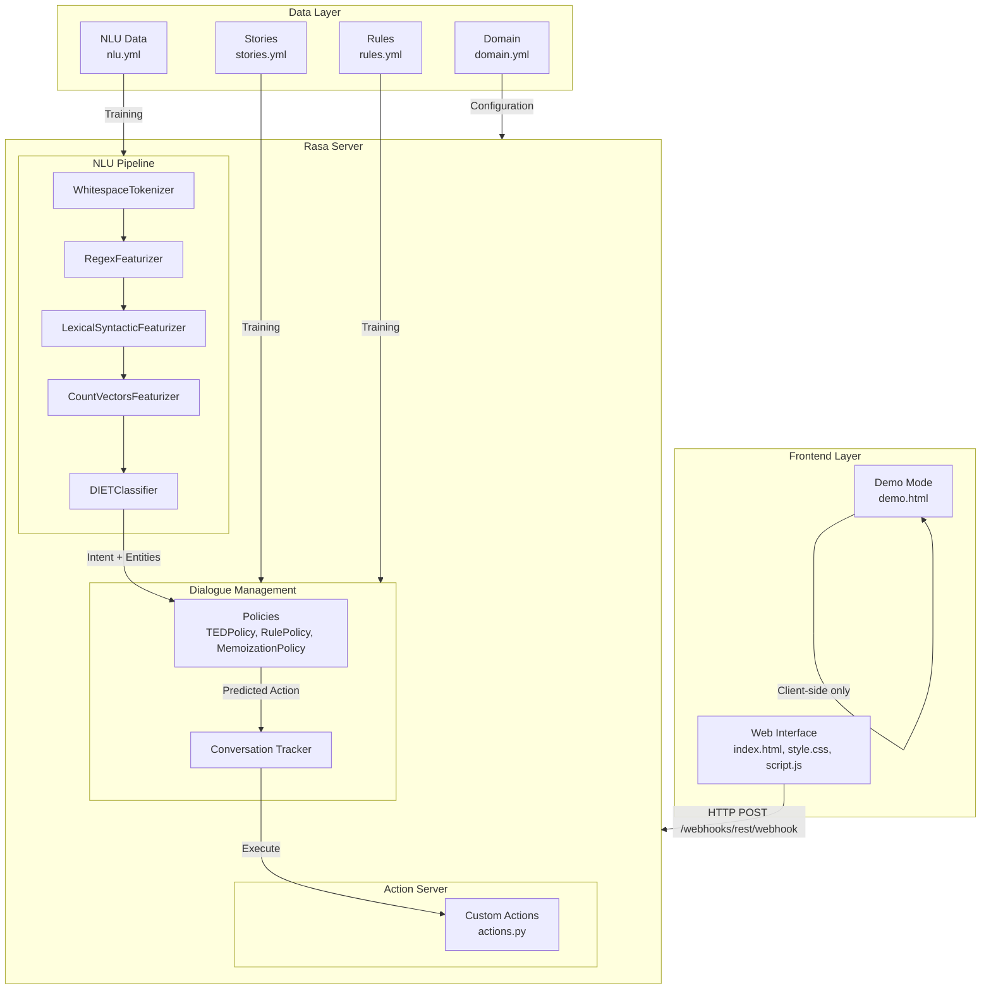
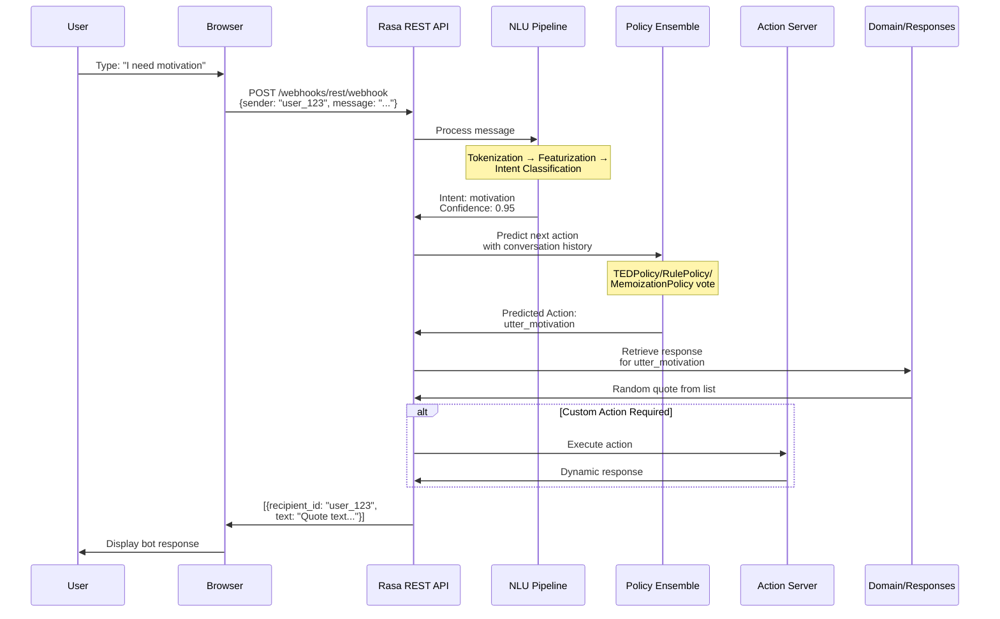
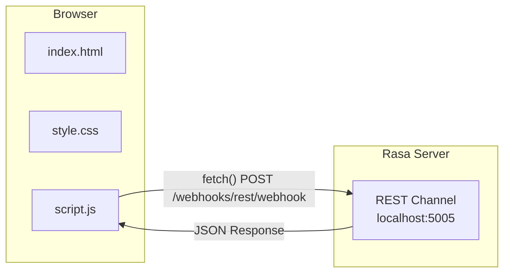
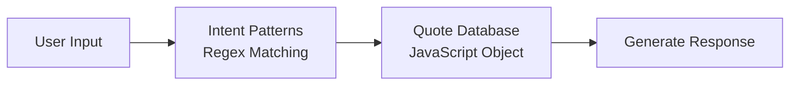
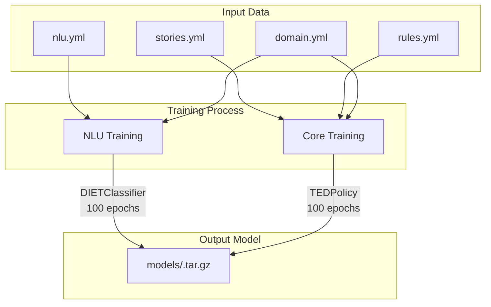

# How the Quotes Recommendation Chatbot Works

This document provides a detailed technical explanation of the Quotes Recommendation Chatbot architecture, components, and data flow.

## Table of Contents

1. [Architecture Overview](#1-architecture-overview)
2. [Data Flow](#2-data-flow)
3. [Component Deep Dive](#3-component-deep-dive)
4. [Web Interface Integration](#4-web-interface-integration)
5. [Demo Mode](#5-demo-mode)
6. [Training Process](#6-training-process)

---

## 1. Architecture Overview

The Quotes Recommendation Chatbot is built on the **Rasa** open-source framework, which provides a complete solution for building conversational AI. The architecture follows a modular design with clear separation between Natural Language Understanding (NLU), dialogue management, and response generation.

### High-Level Architecture Diagram



### System Components

| Component | File(s) | Purpose |
|-----------|---------|---------|
| **NLU Pipeline** | [`config.yml`](config.yml) | Processes user messages to extract intent and entities |
| **Dialogue Policies** | [`config.yml`](config.yml) | Decides next action based on conversation context |
| **Training Data** | [`data/nlu.yml`](data/nlu.yml), [`data/stories.yml`](data/stories.yml), [`data/rules.yml`](data/rules.yml) | Examples for training the ML models |
| **Domain** | [`domain.yml`](domain.yml) | Defines intents, responses, and session config |
| **Custom Actions** | [`actions/actions.py`](actions/actions.py) | Python code for dynamic responses |
| **Web Interface** | [`web/index.html`](web/index.html), [`web/script.js`](web/script.js), [`web/style.css`](web/style.css) | Frontend chat UI |
| **Demo Mode** | [`web/demo.html`](web/demo.html) | Standalone client-side demo |

---

## 2. Data Flow

The following sequence diagram shows how a user message flows through the system from input to response:



### Step-by-Step Data Flow Explanation

1. **User Input**: User types a message in the web interface (e.g., "I need motivation")

2. **HTTP Request**: The frontend JavaScript sends a POST request to the Rasa REST API endpoint at `http://localhost:5005/webhooks/rest/webhook`

3. **NLU Processing**: Rasa's NLU pipeline processes the message:
   - Tokenization splits the text into tokens
   - Featurizers convert tokens into numerical features
   - DIETClassifier predicts the intent (`motivation`) with confidence score

4. **Dialogue Management**: The Policy ensemble considers:
   - Current intent (`motivation`)
   - Conversation history (stored in Tracker)
   - Trained stories and rules
   - Predicts the next action (`utter_motivation`)

5. **Response Generation**: 
   - For simple utterances, Rasa retrieves a random response from [`domain.yml`](domain.yml)
   - For custom actions, the Action Server executes Python code

6. **HTTP Response**: Rasa returns a JSON array with bot responses

7. **UI Update**: The frontend displays the response to the user

---

## 3. Component Deep Dive

### 3.1 NLU (Natural Language Understanding) - `nlu.yml`

The NLU component is responsible for understanding what the user wants. It's defined in [`data/nlu.yml`](data/nlu.yml).

#### Intent Classification

An **intent** represents the user's goal or purpose. The chatbot supports these intents:

| Intent | Description | Example Utterances |
|--------|-------------|-------------------|
| `greet` | User greetings | "hello", "hi", "good morning" |
| `goodbye` | User farewells | "bye", "goodbye", "see you later" |
| `motivation` | Request motivational quotes | "I need motivation", "motivate me" |
| `inspiration` | Request inspirational quotes | "inspire me", "I need inspiration" |
| `love` | Request love quotes | "love quote", "tell me about love" |
| `funny` | Request funny quotes | "tell me a joke", "make me laugh" |
| `success` | Request success quotes | "success quote", "how to succeed" |
| `bot_challenge` | Questions about bot identity | "are you a bot?", "who are you?" |
| `satisfied` | Positive feedback | "thank you", "this is helpful" |
| `not_satisfied` | Negative feedback | "not helpful", "give me another" |

#### How NLU Training Data Works

```yaml
nlu:
- intent: motivation
  examples: |
    - I need motivation
    - motivate me
    - give me a motivational quote
    - I'm feeling demotivated
    - I need some motivation
```

Each intent contains **training examples** - sample phrases that represent what users might say. Rasa uses these examples to train a machine learning model that can:
- Classify new, unseen messages into the correct intent
- Provide a confidence score (0.0 to 1.0) for predictions

#### The NLU Pipeline (`config.yml`)

```yaml
pipeline:
- name: WhitespaceTokenizer          # Step 1: Split text into tokens
- name: RegexFeaturizer              # Step 2: Extract patterns using regex
- name: LexicalSyntacticFeaturizer   # Step 3: Extract linguistic features
- name: CountVectorsFeaturizer       # Step 4: Create word-level features
- name: CountVectorsFeaturizer       # Step 5: Create character-level features
  analyzer: char_wb
  min_ngram: 1
  max_ngram: 4
- name: DIETClassifier               # Step 6: Classify intent + entities
  epochs: 100
  constrain_similarities: true
```

**Pipeline Explanation:**

1. **WhitespaceTokenizer**: Splits text by whitespace into individual words/tokens
   - Input: "I need motivation"
   - Output: ["I", "need", "motivation"]

2. **RegexFeaturizer**: Identifies patterns like email, phone numbers, but also custom patterns

3. **LexicalSyntacticFeaturizer**: Extracts linguistic features like:
   - Is the token uppercase?
   - Is it a punctuation mark?
   - What's the word shape? (e.g., "Title Case", "UPPERCASE")

4. **CountVectorsFeaturizer (Word)**: Creates a bag-of-words representation
   - Creates a vocabulary from training data
   - Represents messages as word frequency vectors

5. **CountVectorsFeaturizer (Character)**: Creates character n-gram features
   - Captures subword patterns and typos
   - Uses character windows of 1-4 characters

6. **DIETClassifier**: Dual Intent and Entity Transformer
   - A transformer-based neural network
   - Trained for 100 epochs on the NLU data
   - Outputs: Intent classification + confidence score

---

### 3.2 Stories - `stories.yml`

**Stories** define example conversation flows. They train the dialogue model (TEDPolicy) to predict appropriate responses based on conversation context.

#### Story Structure

```yaml
stories:
- story: motivation
  steps:
  - intent: greet           # User says hello
  - action: utter_ask       # Bot asks what they need
  - intent: motivation      # User requests motivation
  - action: utter_motivation  # Bot gives motivational quote
  - action: utter_helpful   # Bot asks if helpful
```

#### Types of Stories

**1. Complete Conversation Flows** (with greeting):
```yaml
- story: motivation
  steps:
  - intent: greet
  - action: utter_ask
  - intent: motivation
  - action: utter_motivation
  - action: utter_helpful
```

**2. Direct Request Flows** (without greeting):
```yaml
- story: motivation no greet
  steps:
  - intent: motivation      # User directly asks for motivation
  - action: utter_motivation
  - action: utter_helpful
```

**3. Interactive Sessions with Feedback**:
```yaml
- story: interactive session with satisfaction
  steps:
  - intent: greet
  - action: utter_ask
  - intent: motivation
  - action: utter_motivation
  - action: utter_helpful
  - intent: satisfied        # User says "thank you"
  - action: utter_satisfied  # Bot responds positively
```

#### How Stories Train the Dialogue Model

The **TEDPolicy** (Transformer Embedding Dialogue Policy) learns from stories:
- It encodes the conversation history as embeddings
- It learns patterns of user intents → bot actions
- During prediction, it uses the full conversation context to decide the next action
- The `max_history: 5` setting means it considers the last 5 conversation turns

---

### 3.3 Rules - `rules.yml`

**Rules** define predictable, deterministic behavior. Unlike stories (which are learned patterns), rules are always followed exactly.

#### Rule Structure

```yaml
rules:
- rule: Say goodbye anytime the user says goodbye
  steps:
  - intent: goodbye
  - action: utter_goodbye
```

#### Types of Rules

**1. Simple Response Rules**:
```yaml
- rule: Say goodbye anytime the user says goodbye
  steps:
  - intent: goodbye
  - action: utter_goodbye

- rule: Say 'I am a bot' anytime the user challenges
  steps:
  - intent: bot_challenge
  - action: utter_iamabot
```

**2. Feedback Handling Rules**:
```yaml
- rule: repeat the task when the user is not satisfied
  steps:
  - intent: not_satisfied
  - action: utter_notsatisfied

- rule: say thanks when the user is satisfied
  steps:
  - intent: satisfied
  - action: utter_satisfied
```

**3. Conversation Start Rule**:
```yaml
- rule: Greet user at start
  conversation_start: true    # Only triggers at start
  steps:
  - intent: greet
  - action: utter_greet
  - action: utter_ask
```

#### Rules vs Stories

| Aspect | Rules | Stories |
|--------|-------|---------|
| **Behavior** | Deterministic (always follows) | Probabilistic (learned pattern) |
| **Use Case** | Fixed responses, commands | Complex multi-turn conversations |
| **Priority** | Higher priority | Lower priority |
| **Examples** | Goodbyes, bot challenges | Quote requests with context |

---

### 3.4 Domain - `domain.yml`

The **Domain** is the chatbot's universe. It defines everything the bot knows about.

#### Domain Structure

```yaml
version: "3.1"

intents:          # All intents the bot can recognize
  - greet
  - goodbye
  - motivation
  - ...

responses:        # All responses the bot can give
  utter_greet:
    - text: "Hey! How can I brighten your day today?"
    - text: "Hello! What kind of inspiration are you looking for?"
  
  utter_motivation:
    - text: "Believe you can and you're halfway there. - Theodore Roosevelt"
    - text: "The future belongs to those who believe..."

session_config:   # Session management
  session_expiration_time: 60
  carry_over_slots_to_new_session: true
```

#### Response Variations

Each response can have **multiple variations**. When Rasa selects `utter_motivation`, it randomly picks one:

```yaml
utter_motivation:
  - text: "Believe you can and you're halfway there. - Theodore Roosevelt"
  - text: "The future belongs to those who believe in the beauty of their dreams. - Eleanor Roosevelt"
  - text: "Don't watch the clock; do what it does. Keep going. - Sam Levenson"
  # ... 10 variations total
```

This provides variety so the bot doesn't sound repetitive.

#### Quote Categories

The domain defines 5 quote categories, each with 10 variations:

| Response | Category | Example Quote |
|----------|----------|---------------|
| `utter_motivation` | Motivation | "Believe you can and you're halfway there..." |
| `utter_inspiration` | Inspiration | "What lies behind us and what lies before us..." |
| `utter_love` | Love | "The best thing to hold onto in life is each other..." |
| `utter_funny` | Funny | "I am so clever that sometimes I don't understand..." |
| `utter_success` | Success | "Success is not the key to happiness..." |

---

### 3.5 Config - `config.yml`

The configuration file defines the **ML Pipeline** and **Policies**.

#### Complete Pipeline Configuration

```yaml
language: en

pipeline:
# ========== NLU COMPONENTS ==========
- name: WhitespaceTokenizer
- name: RegexFeaturizer
- name: LexicalSyntacticFeaturizer

# Word-level features
- name: CountVectorsFeaturizer

# Character-level features (for typo handling)
- name: CountVectorsFeaturizer
  analyzer: char_wb
  min_ngram: 1
  max_ngram: 4

# Intent classification
- name: DIETClassifier
  epochs: 100
  constrain_similarities: true

# Entity synonym normalization
- name: EntitySynonymMapper

# Response selection (for FAQ-style responses)
- name: ResponseSelector
  epochs: 100
  constrain_similarities: true

# Fallback when confidence is low
- name: FallbackClassifier
  threshold: 0.3          # If confidence < 0.3, use fallback
  ambiguity_threshold: 0.1 # If top 2 intents differ by < 0.1, use fallback

# ========== POLICIES ==========
policies:
- name: MemoizationPolicy    # Remembers exact story matches
- name: RulePolicy           # Follows defined rules
- name: TEDPolicy            # ML-based dialogue prediction
  max_history: 5             # Consider last 5 turns
  epochs: 100
  constrain_similarities: true
```

#### Policy Priority

When multiple policies could apply, Rasa uses this priority order:

1. **RulePolicy** (priority 6) - Rules always win if applicable
2. **MemoizationPolicy** (priority 5) - Exact story matches
3. **TEDPolicy** (priority 1) - ML predictions

---

## 4. Web Interface Integration

The web interface connects to Rasa via the **REST Channel**.

### Architecture



### REST API Communication

#### Request Format

```javascript
fetch('http://localhost:5005/webhooks/rest/webhook', {
    method: 'POST',
    headers: { 'Content-Type': 'application/json' },
    body: JSON.stringify({
        sender: 'user_abc123',      // Unique user ID
        message: 'I need motivation' // User's message
    })
});
```

#### Response Format

```json
[
  {
    "recipient_id": "user_abc123",
    "text": "Believe you can and you're halfway there. - Theodore Roosevelt"
  },
  {
    "recipient_id": "user_abc123",
    "text": "Was this helpful? Let me know if you'd like another quote!"
  }
]
```

### Key Frontend Components

| Function | File | Purpose |
|----------|------|---------|
| `sendMessage()` | [`script.js`](web/script.js) | Sends user message to Rasa API |
| `addMessage()` | [`script.js`](web/script.js) | Adds message to chat UI |
| `showTypingIndicator()` | [`script.js`](web/script.js) | Shows "bot is typing" animation |
| `formatMessage()` | [`script.js`](web/script.js) | Formats text with HTML (bold, newlines) |

### CORS Configuration

The Rasa server must be started with CORS enabled:

```bash
rasa run --enable-api --cors "*"
```

This allows the web interface (running on a different port) to make requests to the Rasa API.

---

## 5. Demo Mode

The demo mode ([`web/demo.html`](web/demo.html)) provides a **standalone, client-side only** version of the chatbot that works without the Rasa server.

### How Demo Mode Works



### Demo Mode Architecture

1. **Client-Side Intent Detection**: Uses JavaScript regex patterns instead of ML
   ```javascript
   const intentPatterns = {
       motivation: /\b(motivat|encourag|boost|drive|persever).../i,
       inspiration: /\b(inspir|creativ|dream|wisdom).../i,
       // ... more patterns
   };
   ```

2. **In-Memory Quote Database**: JavaScript object with quote arrays
   ```javascript
   const quotesDB = {
       motivation: [/* 5 quotes */],
       inspiration: [/* 5 quotes */],
       // ... more categories
   };
   ```

3. **Rule-Based Response Generation**: Simple switch statement
   ```javascript
   function generateResponse(intent) {
       switch(intent) {
           case 'motivation':
               return ["💪 Here's some motivation:", 
                       getRandomItem(quotesDB.motivation)];
           // ... more cases
       }
   }
   ```

### Demo vs Full Mode Comparison

| Feature | Demo Mode | Full Rasa Mode |
|---------|-----------|----------------|
| **Server Required** | No | Yes (Rasa on :5005) |
| **Intent Detection** | Regex patterns | ML (DIETClassifier) |
| **Quote Database** | 5 quotes/category | 10 quotes/category |
| **Learning Capability** | None | Learns from stories |
| **Use Case** | UI testing, demos | Production use |

---

## 6. Training Process

Training creates machine learning models from your training data.

### Training Command

```bash
rasa train
```

This single command trains both NLU and Core models.

### What Happens During Training



### NLU Training

1. **Data Loading**: Reads [`nlu.yml`](data/nlu.yml) and extracts intents/examples
2. **Pipeline Initialization**: Creates components defined in [`config.yml`](config.yml)
3. **Feature Extraction**: 
   - Tokenizes all examples
   - Builds vocabulary for CountVectorsFeaturizer
   - Creates training feature vectors
4. **Model Training**:
   - DIETClassifier trains for 100 epochs
   - Learns to map features → intents
   - Uses transformer architecture with attention mechanism
5. **Validation**: Tests on held-out data to check accuracy

### Core (Dialogue) Training

1. **Story Processing**: Converts stories to training dialogues
2. **Policy Training**:
   - **MemoizationPolicy**: Builds lookup table of story paths
   - **RulePolicy**: Compiles rules into deterministic lookup
   - **TEDPolicy**: Trains transformer for 100 epochs to predict actions from dialogue context
3. **Ensemble Creation**: Combines all policies with priorities

### Training Output

```
models/
└── 20240227-135008.tar.gz    # Trained model with timestamp
```

The model file contains:
- Trained NLU components (tokenizer, featurizers, DIETClassifier)
- Trained dialogue policies (TEDPolicy)
- Rule lookup tables
- Configuration and domain data

### Testing the Trained Model

```bash
# Test NLU
rasa shell nlu

# Test full conversation
rasa shell

# Run automated tests
rasa test
```

---

## Summary

The Quotes Recommendation Chatbot uses a modular Rasa architecture:

1. **NLU Pipeline** ([`config.yml`](config.yml) + [`nlu.yml`](data/nlu.yml)): Understands user intent using DIETClassifier
2. **Dialogue Management** ([`config.yml`](config.yml) + [`stories.yml`](data/stories.yml) + [`rules.yml`](data/rules.yml)): Decides responses using TEDPolicy and RulePolicy
3. **Response Generation** ([`domain.yml`](domain.yml)): Provides varied quote responses
4. **Web Interface** ([`web/`](web/)): Connects via REST API with real-time chat UI
5. **Demo Mode** ([`web/demo.html`](web/demo.html)): Client-side fallback for testing

The training process (`rasa train`) creates ML models that power intent classification and dialogue prediction, enabling the bot to understand natural language and maintain contextual conversations.