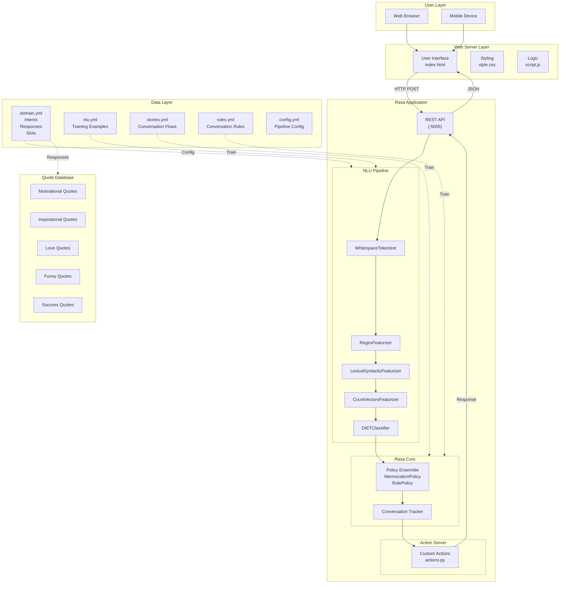
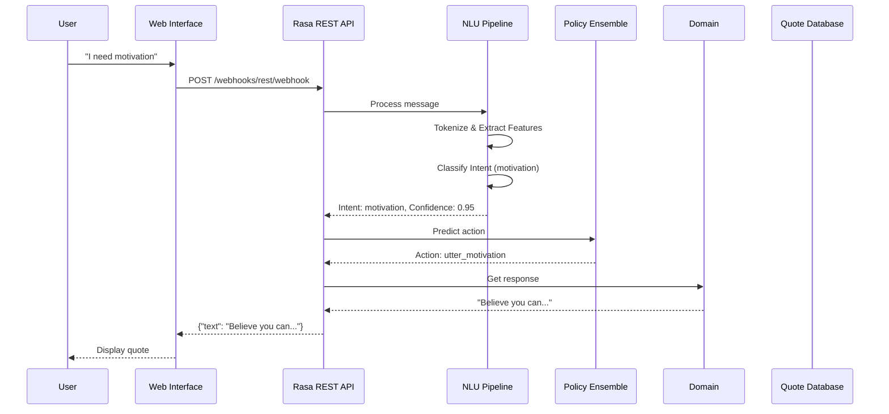
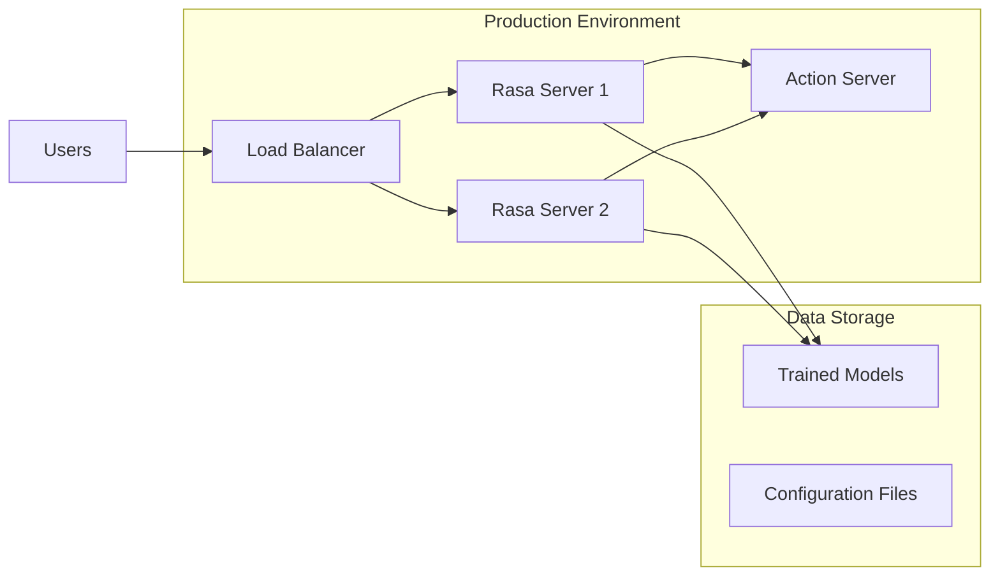

# Project Design Phase-I - Solution Architecture

**Date:** 19 September 2022  
**Team ID:** PNT2022TMID51974  
**Project Name:** Quotes Recommendation Chatbot Using NLP  
**Maximum Marks:** 4 Marks

---

## Solution Architecture

Solution architecture is a complex process – with many sub-processes – that bridges the gap between business problems and technology solutions. Its goals are to:

- Find the best tech solution to solve existing business problems
- Describe the structure, characteristics, behavior, and other aspects of the software to project stakeholders
- Define features, development phases, and solution requirements
- Provide specifications according to which the solution is defined, managed, and delivered

---

## Architecture Diagram

---

## Component Interaction Diagram

---

## Data Flow

### Request Flow

1. **User Input**: User types message in web interface
2. **HTTP Request**: Message sent to Rasa REST API
3. **NLU Processing**: Message tokenized and intent classified
4. **Policy Decision**: Next action predicted based on conversation state
5. **Response Selection**: Appropriate quote selected from domain responses
6. **HTTP Response**: Quote returned to web interface
7. **Display**: Quote displayed to user

### Training Flow

1. **NLU Training**: nlu.yml used to train intent classifier
2. **Core Training**: stories.yml and rules.yml used to train dialogue manager
3. **Model Creation**: Trained model saved to models/ directory
4. **Model Loading**: Rasa server loads model at startup

---

## Layer Description

### Frontend Layer

| Component | Technology | Purpose |
|-----------|------------|---------|
| HTML | HTML5 | Chat interface structure |
| CSS | CSS3 | Styling and responsive design |
| JavaScript | ES6+ | Frontend logic and API calls |

### Backend Layer (Rasa)

| Component | Technology | Purpose |
|-----------|------------|---------|
| NLU Pipeline | Rasa NLU | Intent classification |
| Dialogue Manager | Rasa Core | Conversation flow |
| Action Server | Python | Custom response logic |
| REST API | Flask | HTTP endpoints |

### Data Layer

| Component | File | Purpose |
|-----------|------|---------|
| Domain | domain.yml | Intents, responses, slots |
| Training Data | nlu.yml | Intent examples |
| Stories | stories.yml | Conversation paths |
| Rules | rules.yml | Rule-based flows |
| Config | config.yml | Pipeline configuration |

---

## Deployment Architecture

---

## API Endpoints

| Endpoint | Method | Description |
|----------|--------|-------------|
| /webhooks/rest/webhook | POST | Main chatbot endpoint |
| /model/parse | POST | NLU parsing endpoint |
| /conversations/{sender_id}/tracker | GET | Get conversation state |
| /conversations/{sender_id}/respond | POST | Get bot response |

---

## Security Architecture

| Security Measure | Implementation |
|-----------------|----------------|
| Input Validation | Sanitize user messages |
| CORS | Configure allowed origins |
| API Security | Use HTTPS in production |
| Data Privacy | No persistent user data |

---

## Performance Architecture

| Optimization | Technique |
|--------------|----------|
| Response Time | Optimized NLU pipeline |
| Concurrency | Multiple Rasa instances |
| Model Size | Efficient model training |
| Caching | Cache frequent responses |

---

## Conclusion

The Solution Architecture provides a clear blueprint for the Quotes Recommendation Chatbot. The architecture:

- **Separates concerns** through modular design
- **Scales horizontally** with multiple Rasa instances
- **Enables extensibility** through configurable components
- **Ensures reliability** through robust error handling
- **Optimizes performance** through efficient pipeline design

The architecture is built on proven Rasa NLU framework, ensuring maintainability and educational value.
