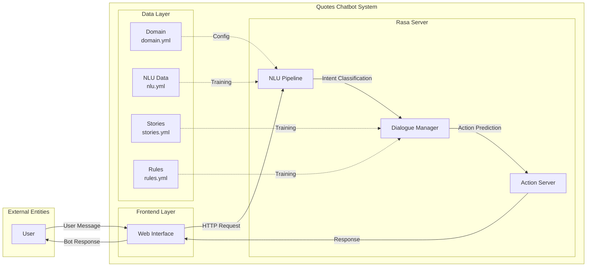
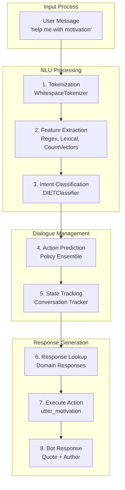

# Project Design Phase-II - Data Flow Diagram & User Stories

**Date:** 31 January 2025  
**Team ID:** PNT2022TMID51974  
**Project Name:** Quotes Recommendation Chatbot Using NLP  
**Maximum Marks:** 4 Marks

---

## Data Flow Diagrams

A Data Flow Diagram (DFD) is a traditional visual representation of the information flows within a system. A neat and clear DFD can depict the right amount of the system requirement graphically. It shows how data enters and leaves the system, what changes the information, and where data is stored.

---

## DFD Level 0 (System Context Diagram)

---

## DFD Level 1 (Process Flow)

---

## Data Flow Description

### Flow 1: User Greeting
1. User enters greeting message in web interface
2. Message sent to Rasa NLU pipeline
3. Intent classified as "greet"
4. Policy predicts "utter_greet" action
5. Bot responds with greeting from domain.yml

### Flow 2: Quote Request
1. User requests quote (e.g., "I need motivation")
2. NLU processes and classifies intent as "motivation"
3. Dialogue Manager identifies correct response action
4. Action server selects motivational quote from responses
5. Quote delivered to user via web interface

### Flow 3: User Feedback
1. User provides feedback ("thank you" or "not helpful")
2. NLU classifies intent as "satisfied" or "not_satisfied"
3. Appropriate response action triggered
4. Confirmation message displayed

---

## User Stories

Use the below template to list all the user stories for the product.

---

### User Story Template

| User Type | Functional Requirement (Epic) | User Story Number | User Story / Task | Acceptance Criteria | Priority | Release |
|-----------|-------------------------------|-------------------|------------------|--------------------|----------|---------|
| Customer | Quote Request | USN-1 | As a user, I can request a motivational quote by typing "motivate me" | Bot responds with a motivational quote | High | Sprint-1 |
| Customer | Quote Request | USN-2 | As a user, I can request an inspirational quote by typing "inspire me" | Bot responds with an inspirational quote | High | Sprint-1 |
| Customer | Quote Request | USN-3 | As a user, I can request a love quote by typing "love quote" | Bot responds with a love quote | High | Sprint-1 |
| Customer | Quote Request | USN-4 | As a user, I can request a funny quote by typing "tell me a joke" | Bot responds with a funny quote | High | Sprint-1 |
| Customer | Quote Request | USN-5 | As a user, I can request a success quote by typing "success quote" | Bot responds with a success quote | High | Sprint-1 |
| Customer | Conversation | USN-6 | As a user, I can greet the bot with "hello" | Bot responds with greeting | High | Sprint-1 |
| Customer | Conversation | USN-7 | As a user, I can say goodbye to the bot | Bot responds with farewell message | High | Sprint-1 |
| Customer | Feedback | USN-8 | As a user, I can express satisfaction with "thank you" | Bot acknowledges with positive response | Medium | Sprint-1 |
| Customer | Feedback | USN-9 | As a user, I can express dissatisfaction with "not helpful" | Bot offers alternative quote | Medium | Sprint-1 |
| Customer | Bot Identity | USN-10 | As a user, I can ask "are you a bot?" | Bot explains it is Rasa-powered | Low | Sprint-1 |

---

## Detailed User Stories

### USN-1: Request Motivational Quote

| Field | Value |
|-------|-------|
| **User Type** | Customer (Web user) |
| **Epic** | Quote Request |
| **User Story** | As a user, I can request a motivational quote by typing "motivate me" |
| **Acceptance Criteria** | Bot responds with a motivational quote from the predefined list |

**Test Scenario:**
- Input: "I need motivation"
- Expected Output: "Believe you can and you're halfway there. - Theodore Roosevelt"

---

### USN-2: Request Inspirational Quote

| Field | Value |
|-------|-------|
| **User Type** | Customer (Web user) |
| **Epic** | Quote Request |
| **User Story** | As a user, I can request an inspirational quote by typing "inspire me" |
| **Acceptance Criteria** | Bot responds with an inspirational quote from the predefined list |

---

### USN-3: Request Love Quote

| Field | Value |
|-------|-------|
| **User Type** | Customer (Web user) |
| **Epic** | Quote Request |
| **User Story** | As a user, I can request a love quote by typing "love quote" |
| **Acceptance Criteria** | Bot responds with a love quote from the predefined list |

---

### USN-4: Request Funny Quote

| Field | Value |
|-------|-------|
| **User Type** | Customer (Web user) |
| **Epic** | Quote Request |
| **User Story** | As a user, I can request a funny quote by typing "tell me a joke" |
| **Acceptance Criteria** | Bot responds with a funny/humorous quote |

---

### USN-5: Request Success Quote

| Field | Value |
|-------|-------|
| **User Type** | Customer (Web user) |
| **Epic** | Quote Request |
| **User Story** | As a user, I can request a success quote by typing "success quote" |
| **Acceptance Criteria** | Bot responds with a success-oriented quote |

---

## Summary

The Data Flow Diagram and User Stories document provides:

1. **Visual representation** of how data flows through the Rasa chatbot system
2. **User-focused stories** that define what users can accomplish with the system
3. **Clear acceptance criteria** for each feature
4. **Priority-based backlog** for sprint planning

All user stories align with the core functionality of the Quotes Recommendation Chatbot using Rasa NLP.
