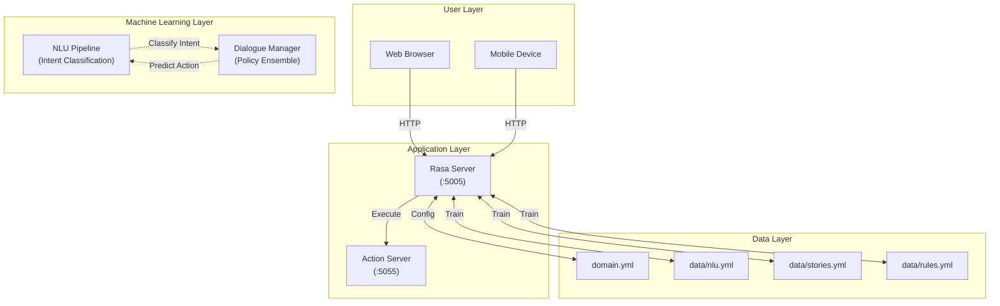

# Project Design Phase-II - Technology Stack (Architecture & Stack)

**Date:** 31 January 2025  
**Team ID:** PNT2022TMID51974  
**Project Name:** Quotes Recommendation Chatbot Using NLP  
**Maximum Marks:** 4 Marks

---

## Technical Architecture

The Deliverable shall include the architectural diagram as below and the information as per the tables.

---

## High-Level Architecture Diagram



---

## Table-1: Components & Technologies

| S.No | Component | Description | Technology |
|------|-----------|-------------|------------|
| 1 | User Interface | How user interacts with application | HTML, CSS, JavaScript |
| 2 | Chatbot Framework | Natural Language Understanding | Rasa NLU |
| 3 | Intent Classification | Classify user intents | DIETClassifier |
| 4 | Response Selection | Select appropriate response | ResponseSelector |
| 5 | Dialogue Management | Manage conversation flow | Rasa Core Policies |
| 6 | Custom Actions | Dynamic response handling | Python |
| 7 | Training Data | NLU training examples | YAML (nlu.yml) |
| 8 | Conversation Stories | Dialogue flows | YAML (stories.yml) |
| 9 | Domain Configuration | Intents, responses, slots | YAML (domain.yml) |
| 10 | Web Server | Host web interface | Python http.server |
| 11 | REST API | Communication protocol | Rasa REST API |

---

## Table-2: Application Characteristics

| S.No | Characteristics | Description | Technology |
|------|-----------------|-------------|------------|
| 1 | Open-Source Frameworks | List the open-source frameworks used | Rasa Open Source |
| 2 | Security Implementations | Security / access controls implemented | Input sanitization, CORS configuration |
| 3 | Scalable Architecture | Justify the scalability of architecture | Modular component design |
| 4 | Availability | Justify the availability of application | Local server deployment |
| 5 | Performance | Design consideration for performance | Optimized NLU pipeline |

---

## NLU Pipeline Configuration

The chatbot uses a DIETClassifier-based pipeline for intent classification:

```yaml
pipeline:
  - name: WhitespaceTokenizer
  - name: RegexFeaturizer
  - name: LexicalSyntacticFeaturizer
  - name: CountVectorsFeaturizer
  - name: CountVectorsFeaturizer
    analyzer: char_wb
    min_ngram: 1
    max_ngram: 4
  - name: DIETClassifier
    epochs: 100
    constrain_similarities: true
  - name: EntitySynonymMapper
  - name: ResponseSelector
    epochs: 100
    constrain_similarities: true
  - name: FallbackClassifier
    threshold: 0.3
    ambiguity_threshold: 0.1
```

### Pipeline Components

| Component | Purpose |
|-----------|---------|
| WhitespaceTokenizer | Tokenizes input text by whitespace |
| RegexFeaturizer | Extracts regex-based features |
| LexicalSyntacticFeaturizer | Creates lexical and syntactic features |
| CountVectorsFeaturizer | Creates bag-of-words features |
| DIETClassifier | Dual Intent and Entity Transformer for intent classification |
| EntitySynonymMapper | Maps synonyms to canonical entities |
| ResponseSelector | Selects appropriate response |
| FallbackClassifier | Handles low-confidence predictions |

---

## Dialogue Management Policies

```yaml
policies:
  - name: MemoizationPolicy
  - name: RulePolicy
  - assistant_id: 20260302-134726-oriented-list
```

### Policy Configuration

| Policy | Purpose |
|--------|---------|
| MemoizationPolicy | Remembers story steps |
| RulePolicy | Enforces rule-based conversations |

---

## Infrastructure

### Local Server Configuration

| Component | Specification |
|-----------|---------------|
| Python Version | 3.8 - 3.10 |
| Rasa Version | 3.6.0 |
| RAM | 4GB minimum |
| Storage | 500MB for models |

### Server Ports

| Port | Service |
|------|---------|
| 5005 | Rasa Server (REST API) |
| 5055 | Action Server |
| 8080 | Web Interface (optional) |

---

## Technology Summary

| Category | Technology |
|----------|------------|
| Backend | Python 3.8+ |
| NLP Framework | Rasa NLU 3.6.0 |
| Frontend | HTML5, CSS3, JavaScript |
| Data Format | YAML |
| Deployment | Local Server |

---

## References

- https://rasa.com/docs/rasa/
- https://c4model.com/
- https://www.rasa.com/docs/rasa/nlu/components/
- https://www.rasa.com/docs/rasa/core/policies/
