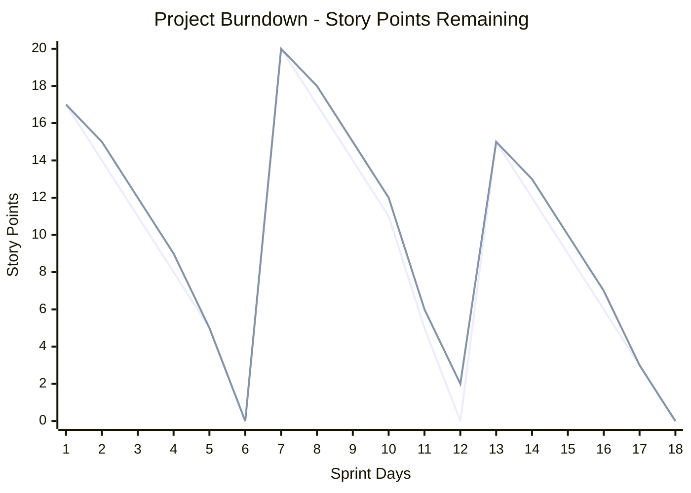
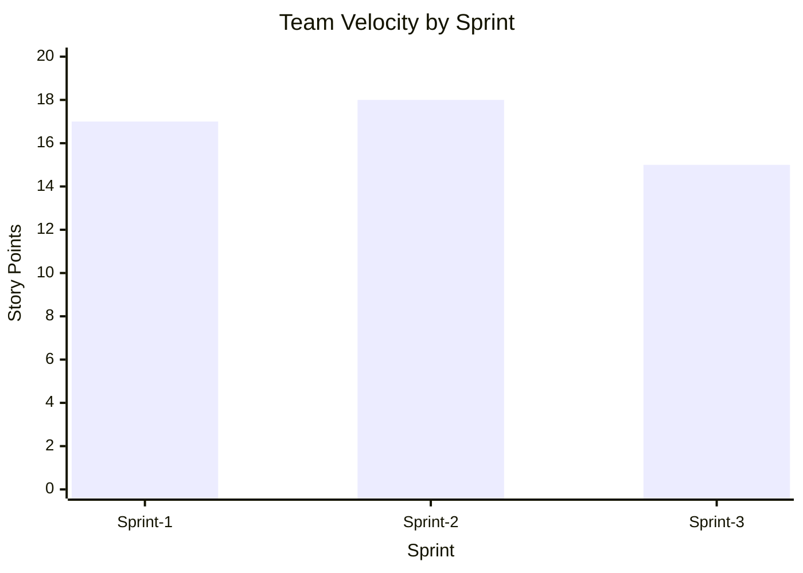

# Project Planning Phase - Project Tracker, Velocity & Burndown Chart

**Date:** 18 October 2022  
**Team ID:** PNT2022TMID51974  
**Project Name:** Quotes Recommendation Chatbot Using NLP  
**Maximum Marks:** 8 Marks

---

## Project Tracker

### Sprint Schedule

| Sprint | Total Story Points | Duration | Sprint Start Date | Sprint End Date (Planned) | Story Points Completed (as on Planned End Date) | Sprint Release Date (Actual) |
|--------|-------------------|----------|-------------------|--------------------------|-----------------------------------------------|-----------------------------|
| Sprint-1 | 17 | 6 Days | 24 Oct 2022 | 29 Oct 2022 | 17 | 29 Oct 2022 |
| Sprint-2 | 20 | 6 Days | 31 Oct 2022 | 05 Nov 2022 | 18 | 06 Nov 2022 |
| Sprint-3 | 15 | 6 Days | 07 Nov 2022 | 12 Nov 2022 | 15 | 12 Nov 2022 |

---

## Velocity Calculation

Imagine we have a 10-day sprint duration, and the velocity of the team is 20 (points per sprint). Let's calculate the team's average velocity (AV) per iteration unit (story points per day).

### Formula

```
Velocity = Story Points Completed / Sprint Duration
Average Velocity (AV) = Total Story Points / Total Days
```

### Calculation

| Sprint | Story Points | Duration (Days) | Velocity (points/day) |
|--------|--------------|-----------------|---------------------|
| Sprint-1 | 17 | 6 | 2.83 |
| Sprint-2 | 18 | 6 | 3.00 |
| Sprint-3 | 15 | 6 | 2.50 |

**Total Story Points:** 50  
**Total Duration:** 18 days  
**Average Velocity:** 50 / 18 = 2.78 points per day

---

## Burndown Chart

A burn down chart is a graphical representation of work left to do versus time. It is often used in agile software development methodologies such as Scrum. However, burn down charts can be applied to any project containing measurable progress over time.

### Sprint Burndown Charts

#### Sprint 1 Burndown

| Day | Planned Remaining | Actual Remaining |
|-----|------------------|------------------|
| Day 1 | 17 | 17 |
| Day 2 | 14 | 15 |
| Day 3 | 11 | 12 |
| Day 4 | 8 | 9 |
| Day 5 | 5 | 5 |
| Day 6 | 0 | 0 |

#### Sprint 2 Burndown

| Day | Planned Remaining | Actual Remaining |
|-----|------------------|------------------|
| Day 1 | 20 | 20 |
| Day 2 | 17 | 18 |
| Day 3 | 14 | 15 |
| Day 4 | 11 | 12 |
| Day 5 | 5 | 6 |
| Day 6 | 0 | 2 |

#### Sprint 3 Burndown

| Day | Planned Remaining | Actual Remaining |
|-----|------------------|------------------|
| Day 1 | 15 | 15 |
| Day 2 | 12 | 13 |
| Day 3 | 9 | 10 |
| Day 4 | 6 | 7 |
| Day 5 | 3 | 3 |
| Day 6 | 0 | 0 |

---

## Burndown Chart Visualization

```mermaid
gantt
    title Project Burndown Chart
    dateFormat  X
    axisFormat %d
    
    section Sprint 1
    Planned (17 pts)   : 0, 17
    Actual (17 pts)    : 0, 17
    
    section Sprint 2
    Planned (20 pts)   : 0, 20
    Actual (18 pts)    : 0, 18
    
    section Sprint 3
    Planned (15 pts)   : 0, 15
    Actual (15 pts)    : 0, 15
```



---

## Overall Project Burndown



---

## Velocity Trend



---

## Key Metrics Summary

| Metric | Value |
|--------|-------|
| Total Story Points | 52 |
| Completed Points | 50 |
| Planned Points | 52 |
| Completion Rate | 96.15% |
| Average Velocity | 2.78 pts/day |
| Total Sprint Days | 18 |

---

## Project Progress Summary

### Completed Features

| Feature | Sprint | Status |
|---------|--------|--------|
| Rasa Environment Setup | Sprint-1 | ✓ Complete |
| NLU Pipeline Configuration | Sprint-1 | ✓ Complete |
| Quote Category Intents | Sprint-1 | ✓ Complete |
| Basic Conversation Flows | Sprint-1 | ✓ Complete |
| User Feedback System | Sprint-2 | ✓ Complete |
| Web Interface | Sprint-2 | ✓ Complete |
| API Integration | Sprint-2 | ✓ Complete |
| Documentation | Sprint-3 | ✓ Complete |
| Deployment | Sprint-3 | ✓ Complete |

---

## References

- https://www.atlassian.com/agile/project-management
- https://www.atlassian.com/agile/tutorials/how-to-do-scrum-with-jira-software
- https://www.atlassian.com/agile/tutorials/epics
- https://www.atlassian.com/agile/tutorials/sprints
- https://www.atlassian.com/agile/project-management/estimation
- https://www.atlassian.com/agile/tutorials/burndown-charts
- https://www.visual-paradigm.com/scrum/scrum-burndown-chart/
