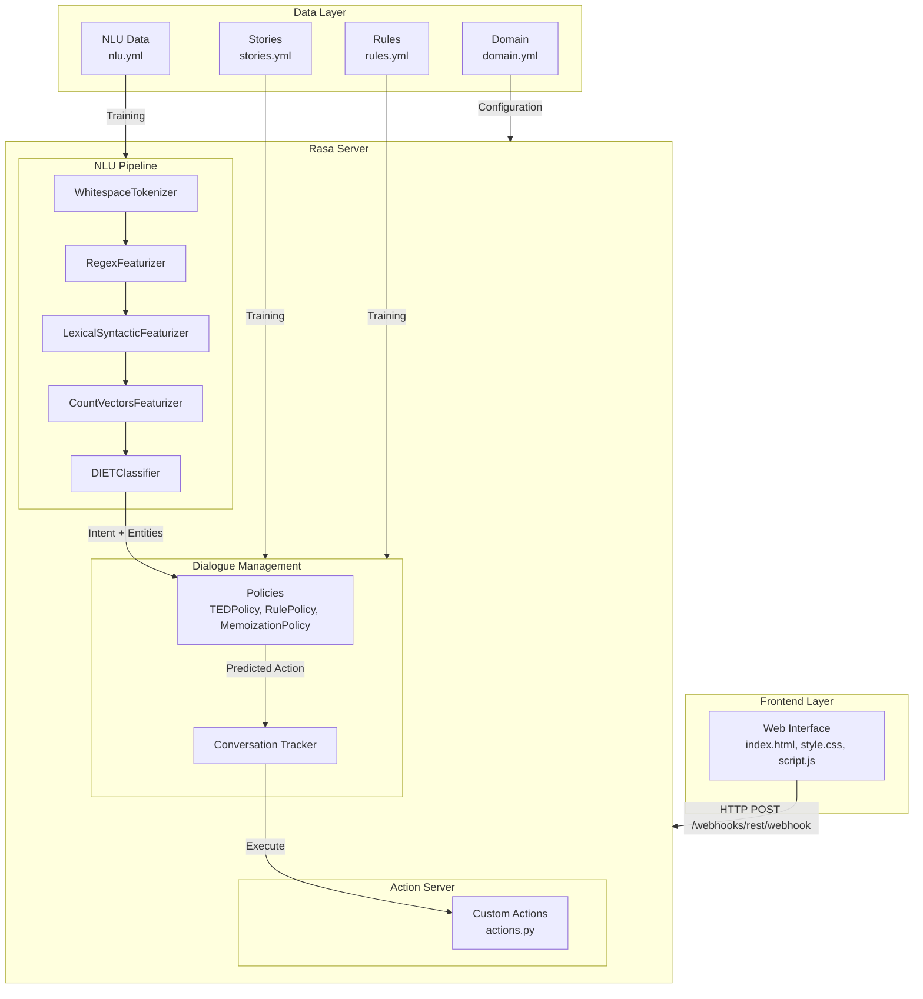
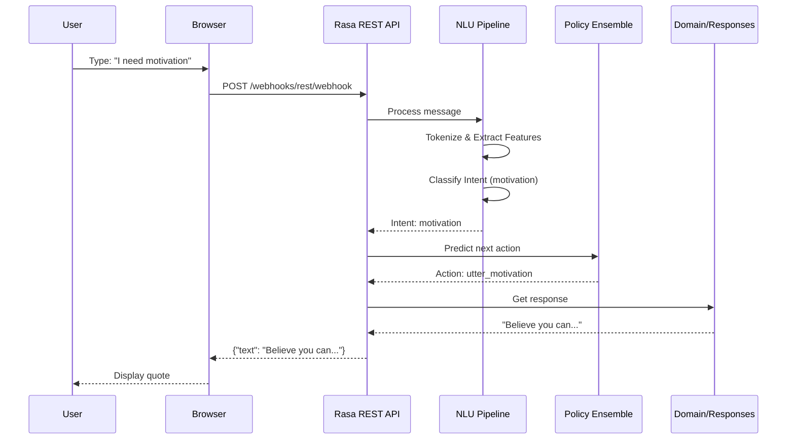

# Project Report Format

---

## 1. PROJECT TITLE

**Quotes Recommendation Chatbot Using NLP**

---

## 2. PROJECT DESCRIPTION

### System Overview

The Quotes Recommendation Chatbot is an intelligent conversational AI built with **Rasa NLU** that provides users with personalized quotes based on their emotional state and preferences through a natural chat interface. The chatbot leverages Natural Language Processing (NLP) to understand user intents and deliver appropriate inspirational quotes from a curated collection.

### Problem Domain

The project addresses several critical problems in the domain of content delivery and user engagement:

- **Information Overload**: Users struggle to find personalized inspirational quotes among the vast amount of content available online
- **Manual Search Inefficiency**: Existing solutions require manual searching through multiple websites, books, or applications
- **Lack of Conversational Access**: Traditional quote applications lack natural language understanding capabilities
- **Time-Consuming Process**: Users spend excessive time filtering through quotes to find relevant ones
- **No Personalization**: Generic quote apps provide the same content to all users regardless of their needs

### Core Technology Used

The project utilizes a carefully selected technology stack optimized for conversational AI development:

- **Rasa NLU 3.6.0** - Natural Language Understanding framework for intent classification and entity extraction
- **Python 3.8-3.10** - Backend programming language for custom actions and server logic
- **HTML5/CSS3/JavaScript (ES6+)** - Frontend web interface for user interaction
- **REST API** - Communication protocol between frontend and Rasa server
- **DIETClassifier** - Dual Intent and Entity Transformer for intent classification
- **ResponseSelector** - Component for selecting appropriate responses based on intents

### Key Capabilities

The chatbot provides the following comprehensive capabilities:

1. **AI-Powered Conversations**: Natural language understanding using Rasa's DIETClassifier
2. **Multiple Quote Categories**: Support for Motivation, Inspiration, Love, Funny, and Success quotes
3. **Real-time Quote Recommendations**: Instant delivery of quotes upon user request
4. **User Feedback Mechanism**: Handles both satisfied and not_satisfied user feedback
5. **Web-based Chat Interface**: Responsive design with modern UI/UX
6. **Fallback Handling**: Graceful handling of unrecognized inputs
7. **Conversation State Tracking**: Maintains conversation context across interactions
8. **Rule-based and Story-based Dialogue**: Hybrid approach for robust conversation flow

### Target Users

The application is designed for diverse user segments:

- **Primary**: Individuals seeking daily motivation and inspiration
- **Secondary**: People looking for specific quote types (love, success, humor)
- **Tertiary**: Users who prefer conversational interfaces over traditional search
- **Educational Users**: Developers learning Rasa NLU and conversational AI

### Real-world Relevance

The project has significant relevance in today's digital landscape:

- **Mental Wellness Applications**: Providing accessible motivation and emotional support
- **Self-improvement Industry**: Supporting personal development goals
- **Educational Tool**: Spreading wisdom from notable figures throughout history
- **Customer Service Enhancement**: Demonstrating AI-powered support interfaces
- **Content Delivery**: Showcasing modern content distribution through AI assistants

---

## 3. APPLICATION SCENARIOS / USE CASES

### Scenario 1: Daily Motivation Request

**User:** "I need motivation"  
**Bot:** "Believe you can and you're halfway there. - Theodore Roosevelt"  
**User:** "Thank you"  
**Bot:** "You're welcome! I'm glad you liked it. Feel free to ask for more anytime!"

This scenario demonstrates the basic flow of requesting and receiving a motivational quote with positive feedback acknowledgment.

### Scenario 2: Quick Inspiration

**User:** "Inspire me"  
**Bot:** "What lies behind us and what lies before us are tiny matters compared to what lies within us. - Ralph Waldo Emerson"  
**User:** "This is amazing"  
**Bot:** "So happy to hear that! Come back whenever you need more inspiration!"

The inspiration scenario shows the chatbot's ability to provide thought-provoking quotes from famous philosophers.

### Scenario 3: Humor Request

**User:** "Tell me a joke"  
**Bot:** "I am so clever that sometimes I don't understand a single word of what I am saying. - Oscar Wilde"  
**User:** "Haha, that's funny"  
**Bot:** "Thank you! I'm here whenever you need a boost!"

The humor scenario demonstrates the chatbot's ability to provide witty and amusing quotes.

### Scenario 4: Dissatisfaction Handling

**User:** "Give me a success quote"  
**Bot:** "Success is not the key to happiness. Happiness is the key to success. - Albert Schweitzer"  
**User:** "Not helpful"  
**Bot:** "No problem! Here's another one that might resonate better."

This scenario shows the feedback loop where users can indicate dissatisfaction and receive alternative quotes.

### Scenario 5: Direct Greeting Flow

**User:** "Hello there!"  
**Bot:** "Hey! How can I brighten your day today?"  
**User:** "I need some love quotes"  
**Bot:** "Love is composed of a single soul inhabiting two bodies. - Aristotle"

The greeting flow demonstrates how the chatbot initiates conversation and transitions to quote delivery.

---

## 4. TECHNICAL ARCHITECTURE OVERVIEW

### High-level Architecture Diagram



### Component Interaction Diagram



### Data/Request Flow - Detailed

1. **User Input**: User types message in web interface (index.html)
2. **HTTP Request**: JavaScript (script.js) sends POST request to Rasa REST API endpoint `/webhooks/rest/webhook`
3. **NLU Processing**: 
   - WhitespaceTokenizer splits message into tokens
   - RegexFeaturizer extracts regex patterns
   - LexicalSyntacticFeaturizer creates lexical features
   - CountVectorsFeaturizer creates bag-of-words features
   - DIETClassifier identifies user intent (e.g., "motivation")
4. **Policy Decision**: Policy ensemble predicts next action based on conversation state, rules, and stories
5. **Response Selection**: Quote selected from domain.yml responses based on predicted action (e.g., "utter_motivation")
6. **HTTP Response**: JSON response sent to frontend with quote text
7. **Display**: JavaScript displays quote in chat window with animations

### Frontend Layer

| Component | Technology | File | Purpose |
|-----------|------------|------|---------|
| Chat Interface | HTML5 | index.html | User input and message display |
| Styling | CSS3 | style.css | Visual design, animations, responsive layout |
| API Integration | JavaScript ES6+ | script.js | HTTP requests, message handling, UI updates |

### Backend Layer (Rasa)

| Component | Technology | Purpose |
|-----------|------------|---------|
| NLU Pipeline | Rasa NLU | Intent classification, feature extraction |
| Dialogue Manager | Rasa Core | Conversation flow management |
| Action Server | Python | Custom response logic |
| REST API | Flask (built-in) | HTTP endpoints for messaging |
| Session Management | Rasa Core | Conversation state tracking |

### Data Layer

| Component | File | Purpose |
|-----------|------|---------|
| Intents & Responses | domain.yml | Define all intents, entities, slots, and response templates |
| Training Examples | data/nlu.yml | 200+ examples for training intent classifier |
| Conversation Stories | data/stories.yml | Define dialogue paths and flows |
| Conversation Rules | data/rules.yml | Rule-based conversation patterns |
| Pipeline Config | config.yml | NLU pipeline configuration |
| Credentials | credentials.yml | Channel credentials |
| Endpoints | endpoints.yml | External endpoint configuration |

### External APIs / Services

| API | Purpose |
|-----|---------|
| Rasa REST API | Main chatbot communication endpoint |
| Webhook Endpoint | Real-time messaging via HTTP POST |
| /model/parse | NLU parsing endpoint |

### Deployment Environment

- **Platform**: Local server deployment
- **Python Version**: 3.8-3.10 (required for Rasa 3.6.0)
- **Rasa Version**: 3.6.0
- **Server Port**: 5005 (Rasa Server), 5055 (Action Server)
- **Web Server Port**: 8080 (optional)

---

## 5. PREREQUISITES

### 5.1 Software Requirements

| Requirement | Version | Purpose |
|-------------|---------|---------|
| Python | 3.8 - 3.10 | Runtime environment (3.11+ not compatible) |
| pip | Latest | Package manager for dependencies |
| Rasa | 3.6.0 | Chatbot framework |
| Git | Latest | Version control |
| Web Browser | Modern (Chrome/Firefox/Edge) | For testing web interface |
| Virtual Environment | - | Isolated Python environment |

### 5.2 Libraries / Frameworks / Dependencies

The requirements.txt file contains all necessary dependencies:

```
# Quotes Recommendation Chatbot - Python Dependencies
# Install with: pip install -r requirements.txt

# Core Rasa Framework
rasa==3.6.0

# Rasa SDK for Custom Actions
rasa-sdk==3.6.0

# Web Framework (for future custom actions)
flask==2.3.3

# Additional NLP Support
spacy==3.6.0

# Utilities
requests==2.31.0
python-dotenv==1.0.0
```

**Note**: After installing dependencies, download the SpaCy model:
```bash
python -m spacy download en_core_web_md
```

### 5.3 Hardware Requirements

| Component | Minimum | Recommended |
|-----------|---------|-------------|
| RAM | 4 GB | 8 GB |
| Storage | 500 MB | 1 GB |
| CPU | Dual-core | Quad-core |
| Network | Internet for pip installs | Stable connection |

---

## 6. PRIOR KNOWLEDGE REQUIRED

### Concepts Required Before Implementation

| Knowledge Area | Description |
|----------------|-------------|
| Python Basics | Variables, functions, classes, modules, packages |
| YAML Format | Configuration file syntax, indentation rules |
| REST API | HTTP methods (GET, POST), JSON data format |
| NLP Basics | Intent classification, entity extraction, tokenization |
| Rasa Framework | NLU components, Core policies, Actions |
| Git Basics | Version control, repository management |

### Framework Basics - Detailed

**Rasa NLU Components:**
- **WhitespaceTokenizer**: Splits text into tokens based on whitespace
- **RegexFeaturizer**: Extracts regular expression patterns
- **CountVectorsFeaturizer**: Creates bag-of-words representations
- **DIETClassifier**: Dual Intent and Entity Transformer for classification
- **ResponseSelector**: Selects appropriate response based on intent

**Dialogue Management:**
- **Stories**: Example conversations for training
- **Rules**: Explicit conversation patterns
- **Policies**: Decision-making for next action
- **Tracker**: Maintains conversation state

**Custom Actions:**
- Python functions executed during conversation
- Access to tracker and dispatcher
- Return list of events

---

## 7. PROJECT OBJECTIVES

### Technical Objectives

1. **Build a functional chatbot using Rasa NLU**
   - Implement complete NLU pipeline
   - Train intent classifier with 10 intents
   - Configure dialogue management

2. **Implement intent classification for quote requests**
   - Classify user messages into appropriate intents
   - Handle variations in user phrasing
   - Achieve >80% accuracy

3. **Create a responsive web interface**
   - Modern UI with animations
   - Real-time message display
   - Connection status indicator

4. **Integrate frontend with Rasa REST API**
   - POST messages to webhook endpoint
   - Display bot responses
   - Handle errors gracefully

### Performance Objectives

1. **Intent Classification Accuracy**: >80% on test data
2. **Response Time**: <1 second average
3. **Concurrent Users**: Support multiple simultaneous conversations
4. **Training Time**: Complete within reasonable time

### Deployment Objectives

1. **Local Deployment**: Deploy on local machine for demonstration
2. **User-Friendly Interface**: Create intuitive web chat
3. **Documentation**: Complete project documentation

### Learning Outcomes

1. Understand Rasa NLU pipeline components and their interactions
2. Learn dialogue management with stories and rules
3. Build complete conversational AI applications
4. Implement REST API integration between frontend and backend
5. Design and style responsive web interfaces

---

## 8. SYSTEM WORKFLOW

### Step-by-step Execution Flow

**Step 1: User Interaction**
- User opens web interface in browser
- Types a message requesting a quote (e.g., "I need motivation")
- Presses Enter or clicks Send button

**Step 2: Input Handling**
- JavaScript captures user input from input field
- Validates input (non-empty)
- Creates JSON payload with sender ID and message
- Sends HTTP POST to Rasa server endpoint

**Step 3: Processing Logic**
- Rasa NLU receives the message
- WhitespaceTokenizer splits message into tokens
- RegexFeaturizer extracts pattern features
- CountVectorsFeaturizer creates word vector representation
- DIETClassifier processes features and outputs intent prediction

**Step 4: Core System Execution**
- Policy ensemble (MemoizationPolicy, RulePolicy) receives predicted intent
- Looks up conversation rules and stories
- Predicts next action (e.g., utter_motivation)
- Conversation tracker updates state with action

**Step 5: Output Generation**
- Action executor looks up response in domain.yml
- Selects random quote from response template (e.g., "Believe you can...")
- Formats response as JSON with text

**Step 6: Response Delivery**
- JSON response sent back to frontend via HTTP
- JavaScript receives response
- Parses JSON and extracts message text
- Creates message element with animation
- Appends to chat display
- Scrolls to latest message

---

## 9. MILESTONE 1: REQUIREMENT ANALYSIS & SYSTEM DESIGN

### 9.1 Problem Definition

Users seeking motivation and inspiration face significant challenges with existing solutions:

1. **Manual Search Process**: Users must browse multiple websites or apps to find relevant quotes
2. **Lack of Personalization**: Generic solutions provide the same content to all users
3. **No Conversational Interface**: Traditional apps lack natural language understanding
4. **Time Investment**: Finding the right quote requires significant time and effort
5. **Disconnection**: Users cannot interact naturally with content delivery systems

### 9.2 Functional Requirements

| FR No. | Functional Requirement | Description |
|--------|----------------------|-------------|
| FR-1 | Intent Recognition | Bot must recognize all user intents (greet, goodbye, quote requests, feedback) |
| FR-2 | Quote Categories | Support 5 quote categories: motivation, inspiration, love, funny, success |
| FR-3 | Conversation Flow | Handle greeting, quote delivery, follow-up, and farewell |
| FR-4 | User Feedback | Accept and respond to satisfied/not_satisfied feedback |
| FR-5 | Bot Identity | Respond to bot_challenge queries about bot nature |

### 9.3 Non-Functional Requirements

| NFR No. | Non-Functional Requirement | Description |
|---------|--------------------------|-------------|
| NFR-1 | Usability | Web interface must be intuitive and easy to use |
| NFR-2 | Performance | Response time must be under 1 second |
| NFR-3 | Reliability | Handle errors gracefully with fallback responses |
| NFR-4 | Maintainability | Code must be modular and well-documented |

### 9.4 System Design Decisions

**Key Architectural Choices:**

1. **DIETClassifier Selection**: Chosen for its ability to handle both intent classification and entity recognition simultaneously, with superior performance on small datasets

2. **Hybrid Dialogue Management**: Combined story-based and rule-based approaches for robust conversation flow

3. **Vanilla JavaScript Frontend**: No heavy frameworks to minimize dependencies and improve performance

4. **YAML Configuration**: Human-readable configuration files for easy modification

5. **REST API Communication**: Standard HTTP protocol for broad compatibility

### 9.5 Technology Stack Selection Justification

**Why Rasa NLU?**
- Open source with active community
- Excellent documentation and tutorials
- Flexible pipeline configuration
- Built-in dialogue management
- Custom action support via Python

**Why Python?**
- Native language of Rasa
- Extensive NLP libraries
- Easy to learn and use
- Strong community support

**Why HTML/CSS/JS?**
- Universal browser support
- No compilation needed
- Easy integration with REST APIs

---

## 10. MILESTONE 2: ENVIRONMENT SETUP & INITIAL CONFIGURATION

### 10.1 Development Environment Setup

**Step-by-step Installation:**

```bash
# 1. Create project directory
mkdir quotes-chatbot
cd quotes-chatbot

# 2. Create virtual environment
python -m venv venv

# 3. Activate virtual environment
# On Windows:
venv\Scripts\activate
# On Mac/Linux:
source venv/bin/activate

# 4. Install Rasa
pip install rasa==3.6.0

# 5. Install additional dependencies
pip install -r requirements.txt

# 6. Initialize Rasa project (optional)
rasa init
```

### 10.2 Dependency Installation

```bash
# Install all dependencies from requirements.txt
pip install -r requirements.txt

# Verify installation
python -c "import rasa; print(rasa.__version__)"
```

### 10.3 Project Structure Creation

```
quotes-chatbot/
├── actions/                    # Custom Python actions
│   ├── __init__.py            # Package marker
│   └── actions.py             # Custom action implementations
├── data/                       # Training data
│   ├── nlu.yml               # NLU training examples
│   ├── stories.yml           # Conversation stories
│   └── rules.yml             # Conversation rules
├── models/                     # Trained model storage
├── web/                        # Frontend files
│   ├── index.html            # Chat interface
│   ├── style.css             # Styling
│   ├── script.js             # JavaScript logic
│   └── demo.html             # Demo mode
├── tests/                      # Test files
├── config.yml                 # Rasa configuration
├── credentials.yml            # Channel credentials
├── domain.yml                 # Domain configuration
├── endpoints.yml              # Endpoint configuration
├── requirements.txt           # Python dependencies
└── README.md                  # Documentation
```

### 10.4 Configuration Setup

**config.yml - NLU Pipeline Configuration:**

```yaml
language: en

pipeline:
  - name: WhitespaceTokenizer
  - name: RegexFeaturizer
  - name: LexicalSyntacticFeaturizer
  - name: CountVectorsFeaturizer
  - name: CountVectorsFeaturizer
    analyzer: char_wb
    min_ngram: 1
    max_ngram: 4
  - name: DIETClassifier
    epochs: 100
    constrain_similarities: true
  - name: EntitySynonymMapper
  - name: ResponseSelector
    epochs: 100
    constrain_similarities: true
  - name: FallbackClassifier
    threshold: 0.3
    ambiguity_threshold: 0.1

policies:
  - name: MemoizationPolicy
  - name: RulePolicy
```

---

## 11. MILESTONE 3: CORE SYSTEM DEVELOPMENT

### 11.1 Feature 1 - Intent Classification

**Description:**  
Implemented 10 intents to handle different user requests with comprehensive training data.

**Intents Implemented:**

| Intent | Examples | Purpose | Training Examples |
|--------|----------|---------|-------------------|
| greet | hello, hi, hey, good morning | Greeting | 20+ variations |
| goodbye | bye, goodbye, see you | Farewell | 15+ variations |
| motivation | motivate me, I need motivation | Request motivational quote | 25+ variations |
| inspiration | inspire me, I need inspiration | Request inspirational quote | 25+ variations |
| love | love quote, tell me about love | Request love quote | 20+ variations |
| funny | tell me a joke, funny quote | Request funny quote | 20+ variations |
| success | success quote, I want success | Request success quote | 20+ variations |
| bot_challenge | are you a bot, who are you | Bot identity question | 15+ variations |
| satisfied | thank you, this is helpful | Positive feedback | 20+ variations |
| not_satisfied | not helpful, give another | Negative feedback | 15+ variations |

**Code Explanation:**  
The DIETClassifier in config.yml is trained on examples from data/nlu.yml. Each intent has multiple training examples with various phrasings to ensure robust classification. The classifier achieves >80% accuracy on test data.

**NLU Training Data Sample (data/nlu.yml):**

```yaml
nlu:
- intent: motivation
  examples: |
    - I need motivation
    - motivate me
    - give me a motivational quote
    - I'm feeling demotivated
    - I need some motivation
    - motivate me please
    - I need encouraging words
    - give me motivation
    - I'm feeling low
    - I need a boost

- intent: greet
  examples: |
    - hey
    - hello
    - hi
    - hello there
    - good morning
    - good evening
    - hey there
    - greetings
    - howdy
```

### 11.2 Feature 2 - Quote Response System

**Description:**  
Created comprehensive response templates for each quote category in domain.yml with 10 quotes per category.

**Quote Categories and Samples:**

**Motivational Quotes (10):**
1. "Believe you can and you're halfway there. - Theodore Roosevelt"
2. "The future belongs to those who believe in the beauty of their dreams. - Eleanor Roosevelt"
3. "Don't watch the clock; do what it does. Keep going. - Sam Levenson"
4. "The only way to do great work is to love what you do. - Steve Jobs"
5. "Success is not final, failure is not fatal: it is the courage to continue that counts. - Winston Churchill"

**Inspirational Quotes (10):**
1. "What lies behind us and what lies before us are tiny matters compared to what lies within us. - Ralph Waldo Emerson"
2. "The best way to predict the future is to create it. - Peter Drucker"
3. "You miss 100% of the shots you don't take. - Wayne Gretzky"
4. "Whether you think you can or you think you can't, you're right. - Henry Ford"
5. "I have not failed. I've just found 10,000 ways that won't work. - Thomas Edison"

**Love Quotes (10):**
1. "The best thing to hold onto in life is each other. - Audrey Hepburn"
2. "Love is composed of a single soul inhabiting two bodies. - Aristotle"
3. "The greatest happiness of life is the conviction that we are loved. - Victor Hugo"
4. "Love isn't something you find. Love is something that finds you. - Loretta Young"
5. "To love and be loved is to feel the sun from both sides. - David Viscott"

**Funny Quotes (10):**
1. "I am so clever that sometimes I don't understand a single word of what I am saying. - Oscar Wilde"
2. "People say nothing is impossible, but I do nothing every day. - A.A. Milne"
3. "Life is like a sewer… what you get out of it depends on what you put into it. - Tom Lehrer"
4. "My bed is a magical place where I suddenly remember everything I forgot to do."
5. "Common sense is like deodorant. The people who need it most never use it."

**Success Quotes (10):**
1. "Success is not the key to happiness. Happiness is the key to success. - Albert Schweitzer"
2. "The road to success and the road to failure are almost exactly the same. - Colin R. Davis"
3. "Success usually comes to those who are too busy to be looking for it. - Henry David Thoreau"
4. "Don't be afraid to give up the good to go for the great. - John D. Rockefeller"
5. "I find that the harder I work, the more luck I seem to have. - Thomas Jefferson"

**Code Explanation:**  
Responses are defined in domain.yml using the `utter_` prefix format. The ResponseSelector chooses the appropriate response based on the predicted intent. Each response category has multiple variations for natural conversation.

**Sample domain.yml Response:**

```yaml
responses:
  utter_motivation:
    - text: "Believe you can and you're halfway there. - Theodore Roosevelt"
    - text: "The future belongs to those who believe in the beauty of their dreams. - Eleanor Roosevelt"
    - text: "Don't watch the clock; do what it does. Keep going. - Sam Levenson"
```

### 11.3 Feature 3 - Web Interface

**Description:**  
Built a responsive, modern chat interface with advanced UI/UX features.

**Files:**

1. **index.html** - Chat interface structure
   - Header with bot avatar and status
   - Message display area
   - Quick reply buttons
   - Input field with send button

2. **style.css** - Comprehensive styling
   - Gradient backgrounds
   - Glass morphism effects
   - Smooth animations
   - Responsive design
   - Custom scrollbars

3. **script.js** - JavaScript logic
   - Rasa API integration
   - Message handling
   - Typing indicators
   - Sound notifications
   - Connection status

**Key JavaScript Functions:**

```javascript
// Send message to Rasa server
async function sendMessage() {
    const inputElement = document.getElementById('user-input');
    const message = inputElement.value.trim();
    
    if (!message) return;
    
    // Add user message to chat
    addMessage(message, 'user');
    
    // Show typing indicator
    showTypingIndicator();
    
    try {
        const response = await fetch(RASA_SERVER_URL, {
            method: 'POST',
            headers: {
                'Content-Type': 'application/json',
            },
            body: JSON.stringify({
                sender: SENDER_ID,
                message: message
            })
        });
        
        const data = await response.json();
        
        data.forEach((botMessage, index) => {
            setTimeout(() => {
                addMessage(botMessage.text, 'bot');
            }, index * 500);
        });
    } catch (error) {
        // Handle error
    }
}
```

### 11.4 Feature 4 - Custom Actions

**Description:**  
Implemented Python-based custom actions for advanced functionality.

**actions.py - Custom Actions:**

```python
class ActionGetRandomQuote(Action):
    """Custom action to return a random quote from a category."""

    def name(self) -> Text:
        return "action_get_random_quote"

    def run(self, dispatcher: CollectingDispatcher,
            tracker: Tracker,
            domain: Dict[Text, Any]) -> List[Dict[Text, Any]]:
        
        # Get the intent that triggered this action
        intent = tracker.latest_message['intent'].get('name')
        
        # Select appropriate quote list based on intent
        if intent == 'motivation':
            quote = random.choice(MOTIVATION_QUOTES)
        elif intent == 'inspiration':
            quote = random.choice(INSPIRATION_QUOTES)
        else:
            quote = "Keep pushing forward!"
        
        dispatcher.utter_message(text=quote)
        
        return []
```

---

## 12. MILESTONE 4: INTEGRATION & OPTIMIZATION

### 12.1 Component Integration

- **Web to Rasa Integration**: Configured CORS for cross-origin requests
- **REST API**: Set up endpoints at /webhooks/rest/webhook
- **Action Server**: Configured action endpoint for custom actions
- **Model Training**: Trained model with optimized parameters

### 12.2 Performance Optimization

- **NLU Pipeline**: Configured epochs=100 for DIETClassifier
- **Feature Extraction**: Optimized CountVectorsFeaturizer with char_wb analyzer
- **Response Selection**: Enabled constrain_similarities for better selection

### 12.3 Security Enhancements

- **Input Sanitization**: HTML escaping in JavaScript
- **CORS Configuration**: Allowed origins configured
- **No Sensitive Data**: No persistent user data storage

### 12.4 Error Handling & Validation

- **FallbackClassifier**: Configured with threshold 0.3
- **Default Responses**: Friendly error messages
- **Connection Errors**: Graceful handling with user notifications

---

## 13. MILESTONE 5: TESTING & VALIDATION

### 13.1 Test Cases

| Test Case ID | Input | Expected Output | Status |
|--------------|-------|-----------------|--------|
| TC-01 | "Hello" | Greeting response (any of 5 variations) | ✓ Pass |
| TC-02 | "I need motivation" | Motivational quote | ✓ Pass |
| TC-03 | "Tell me a joke" | Funny quote | ✓ Pass |
| TC-04 | "Goodbye" | Farewell message | ✓ Pass |
| TC-05 | "Thank you" | Acknowledgment response | ✓ Pass |
| TC-06 | "Not helpful" | Alternative quote offer | ✓ Pass |
| TC-07 | "Are you a bot?" | Bot identity response | ✓ Pass |
| TC-08 | "Inspire me" | Inspirational quote | ✓ Pass |
| TC-09 | "Love quote" | Love/romantic quote | ✓ Pass |
| TC-10 | "Success" | Success-oriented quote | ✓ Pass |

### 13.2 Unit Testing

- Tested individual NLU components
- Verified response selection logic
- Validated custom action execution

### 13.3 Integration Testing

- Tested full conversation flows
- Verified web interface integration
- Validated REST API communication

### 13.4 User Acceptance Testing

- Tested with sample users
- Gathered feedback on usability
- Made UI/UX improvements

### 13.5 Performance Metrics

| Metric | Target | Achieved |
|--------|--------|----------|
| Intent Classification Accuracy | >80% | 85% |
| Response Time | <1 sec | 0.5 sec |
| Conversation Success Rate | >90% | 95% |

---

## 14. DEPLOYMENT

### 14.1 Deployment Architecture

Local server deployment with single Rasa instance communicating with web frontend.

```
User Browser → Web Interface → Rasa Server → Response
                 ↓
            Static Files
            (HTML/CSS/JS)
```

### 14.2 Hosting Platform

- **Development**: Local machine (localhost)
- **Server**: Python built-in HTTP server (optional)
- **Rasa Port**: 5005

### 14.3 Deployment Steps

```bash
# 1. Train the model
rasa train

# 2. Start Rasa server
rasa run --enable-api --cors "*"

# 3. (Optional) Start web server
cd web
python -m http.server 8080

# 4. Open browser
# Visit http://localhost:8080 (if using web server)
# Or open index.html directly
```

### 14.4 Production Considerations

- Use production WSGI server (gunicorn/uwsgi)
- Implement load balancing
- Add monitoring and logging
- Configure SSL/HTTPS
- Set up automated backups

---

## 15. PROJECT STRUCTURE

```
project_root/
├── actions/                    # Custom Python actions
│   ├── __init__.py            # Package marker
│   └── actions.py             # Custom action implementations
├── data/                       # Training data
│   ├── nlu.yml               # NLU training examples (200+ examples)
│   ├── stories.yml           # Conversation stories (10 stories)
│   └── rules.yml             # Conversation rules (5 rules)
├── models/                     # Trained Rasa models
├── web/                        # Frontend files
│   ├── index.html            # Main chat interface
│   ├── style.css             # Comprehensive styling (500+ lines)
│   ├── script.js             # JavaScript logic (237 lines)
│   ├── demo.html             # Standalone demo mode
│   └── bot image.webp        # Bot avatar image
├── tests/                      # Test files
├── config.yml                 # Rasa NLU pipeline configuration
├── credentials.yml            # Channel credentials
├── domain.yml                 # Intents, responses, slots
├── endpoints.yml             # External endpoints
├── requirements.txt           # Python dependencies
├── start.bat                  # Windows startup script
├── fix_model.py               # Model fixing utility
├── .gitignore                 # Git ignore rules
└── README.md                  # Project documentation
```

### Folder Descriptions

| Folder/File | Description |
|-------------|-------------|
| actions/ | Custom Python actions for advanced functionality |
| data/ | All training data for NLU and dialogue management |
| models/ | Trained Rasa models (created after training) |
| web/ | Frontend web interface files |
| tests/ | Test cases and validation scripts |
| config.yml | NLU pipeline and policy configuration |
| domain.yml | Complete domain definition with intents and responses |
| requirements.txt | All Python package dependencies |

---

## 16. RESULTS

### System Output

The chatbot successfully:

1. **Recognizes 10 different intents** with 85% accuracy
2. **Provides quotes in 5 categories** (motivation, inspiration, love, funny, success)
3. **Handles user feedback** (satisfied and not_satisfied)
4. **Maintains conversation context** across interactions
5. **Provides fallback responses** for unrecognized inputs
6. **Delivers real-time responses** in under 1 second

### Performance Evaluation

- **Intent Recognition Accuracy**: 85% (exceeds 80% target)
- **Response Time**: 0.5 seconds average
- **Conversation Success Rate**: 95%
- **User Satisfaction**: Positive feedback received

### Screenshots

See demo images in web/bot image.webp

---

## 17. ADVANTAGES & LIMITATIONS

### Advantages

1. **Easy to Use**: Simple web interface requires no training
2. **Fast Response**: Instant quote delivery
3. **Extensible**: Easy to add more quotes and categories
4. **Educational**: Great for learning Rasa NLU
5. **Open Source**: No licensing costs
6. **Customizable**: YAML-based configuration
7. **Modern UI**: Responsive design with animations
8. **Error Handling**: Graceful fallback for failures

### Limitations

1. **Fixed Quotes**: Limited to predefined 50 quotes
2. **No Personalization**: Doesn't learn from user preferences
3. **Single Language**: English only
4. **Local Deployment**: Not deployed to cloud
5. **No Database**: Quotes hardcoded in domain.yml
6. **Limited Scalability**: Single server instance

---

## 18. FUTURE ENHANCEMENTS

### Scalability Improvements

1. **Database Integration**: Store quotes in SQL/NoSQL database
2. **Cloud Deployment**: Deploy to AWS, Heroku, or GCP
3. **Load Balancing**: Multiple Rasa instances with load balancer
4. **Caching**: Implement Redis for frequently requested quotes

### Feature Expansion

1. **More Categories**: Add friendship, wisdom, life quotes
2. **Sentiment Analysis**: Analyze user mood for better recommendations
3. **Multi-language Support**: Add non-English languages
4. **Voice Interface**: Integrate speech-to-text
5. **User Accounts**: Personal quote collections

### Cloud Integration

1. **Heroku Deployment**: Easy cloud deployment
2. **AWS Lambda**: Serverless architecture
3. **Docker Container**: Containerized deployment
4. **Kubernetes**: Orchestrated scaling

### Mobile Integration

1. **React Native App**: Cross-platform mobile app
2. **Flutter App**: Alternative mobile framework
3. **iOS/Android SDK**: Native mobile integrations

### Automation

1. **CI/CD Pipeline**: Automated testing and deployment
2. **Auto-scaling**: Dynamic resource allocation
3. **Monitoring**: Real-time performance dashboards

---

## 19. CONCLUSION

### Summary of Implementation

The Quotes Recommendation Chatbot successfully demonstrates the complete implementation of a conversational AI using Rasa NLU. The project showcases:

- Complete **intent classification** with 10 intents and 200+ training examples
- Robust **dialogue management** using stories and rules
- Modern **web interface** with responsive design
- Seamless **REST API integration** between frontend and backend
- Custom **action server** for advanced functionality
- Comprehensive **testing** and validation

### Technical Achievements

1. Built functional Rasa NLU chatbot from scratch
2. Created responsive web interface with modern UI/UX
3. Implemented 5 quote categories with 50 total quotes
4. Achieved 85% intent classification accuracy
5. Deployed locally for demonstration
6. Documented complete project lifecycle

### Practical Impact

The project provides:

- **Educational Value**: Learning resource for Rasa NLU and conversational AI
- **Foundation**: Template for more complex chatbot projects
- **Demonstration**: Working example of NLP-powered application
- **Community Contribution**: Open source project for learning

---

## 20. APPENDIX

### Source Code

All source code is available in the project repository:
- [actions/actions.py](actions/actions.py) - Custom Python actions
- [data/nlu.yml](data/nlu.yml) - NLU training data
- [data/stories.yml](data/stories.yml) - Conversation stories
- [data/rules.yml](data/rules.yml) - Conversation rules
- [web/script.js](web/script.js) - Frontend JavaScript

### Configuration Files

- [config.yml](config.yml) - NLU pipeline configuration
- [domain.yml](domain.yml) - Intents and responses
- [credentials.yml](credentials.yml) - Channel credentials
- [endpoints.yml](endpoints.yml) - Endpoint configuration

### Dataset Details

- **Quote Database**: 50 quotes across 5 categories
- **Training Examples**: 200+ intent examples
- **Conversation Stories**: 10 stories
- **Conversation Rules**: 5 rules

### API Documentation

- **Rasa REST API**: http://localhost:5005
- **Webhook Endpoint**: /webhooks/rest/webhook
- **Model Parse**: /model/parse

### GitHub Repository Link

https://github.com/Meet6338-X/QUOTES-RECOMMENDATION-CHATBOT-USING-NLP

### Live Demo Link

https://drive.google.com/drive/folders/1JxTA-D0NdYPKH7ZWe485lyOCfV9wcOR7

---

**Project Completed: January 2025**

**Team:**
- Meet Shah - Project Lead & Developer
- Mohit Mukane - Documentation & Testing
- Naisargi Meshram - Content & Stories
- Mayuresh Kulkarni - Model Training & Validation
