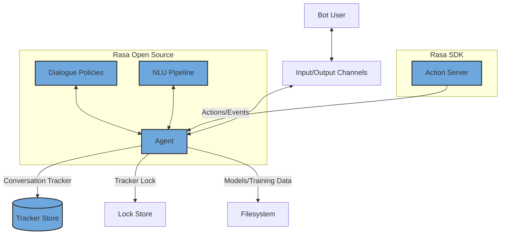

# Quotes Recommendation Chatbot - Project Plan

## Project Overview

An intelligent conversational system built using **Rasa NLU** that provides users with personalized quotes based on their emotional state, preferences, and interests. The chatbot supports multiple categories including Inspiration, Motivation, Success, Love, and Humor.

---

## Architecture



---

## Tech Stack

| Category | Technology |
|----------|------------|
| NLP Framework | Rasa NLU |
| Backend | Python, Flask |
| Frontend | HTML, CSS, JavaScript |
| API | REST API |
| IDE | Visual Studio Code |
| Environment | Python Virtual Environment / Anaconda |

---

## Project Phases

### Phase 1: Problem Definition & Understanding

**Objective:** Define the business problem and requirements

**Stories:**
- [ ] Story 1: Specify the Business Problem
- [ ] Story 2: Business Requirements
- [ ] Story 3: Literature Survey
- [ ] Story 4: Social or Business Impact

**Key Deliverables:**
- Business problem documentation
- Requirements specification
- Impact assessment

#### Story 4: Social or Business Impact

**Social Impact:**
The Quotes Recommendation Chatbot has a significant positive social impact by promoting mental well-being, emotional support, and positivity. By delivering motivational, inspirational, and emotionally supportive quotes on demand, the chatbot helps users cope with stress, anxiety, and demotivation. Its 24/7 availability ensures that users can receive encouragement at any time, making emotional support more accessible and inclusive.

Additionally, the chatbot fosters a positive digital environment by spreading uplifting content and encouraging users to reflect on constructive thoughts. This contributes to improved emotional resilience and overall mental health awareness in society.

**Business Impact:**
From a business perspective, the project demonstrates the practical application of conversational AI in personalized content delivery. The chatbot enhances user engagement by offering tailored responses, which can improve brand perception and customer satisfaction when deployed in real-world applications.

The system also highlights how AI-driven chatbots can reduce manual effort, automate user interactions, and provide scalable solutions for content recommendation. The underlying architecture and approach can be extended to domains such as customer support, wellness platforms, education, and digital marketing, making it a valuable business use case for conversational AI technologies.

---

### Phase 2: Environment Setup

**Objective:** Prepare development environment

**Stories:**
- [ ] Story 1: Install Rasa and Required Dependencies
- [ ] Story 2: Setting Up the Rasa Project

**Tasks:**
1. Create Python virtual environment
   ```bash
   python -m venv venv
   ```
2. Activate virtual environment
   ```bash
   # Windows
   venv\Scripts\activate
   ```
3. Install Rasa and dependencies
   ```bash
   pip install rasa
   ```
4. Initialize Rasa project
   ```bash
   rasa init
   ```

**Key Deliverables:**
- Configured virtual environment
- Initialized Rasa project structure
- `requirements.txt` with all dependencies

---

### Phase 3: Data Collection & Model Building

**Objective:** Build the chatbot's knowledge base and conversational capabilities

**Stories:**
- [ ] Story 1: Data Collection – Creating User Queries (`nlu.yml`)
- [ ] Story 2: Creating Bot Responses (`domain.yml`)
- [ ] Story 3: Defining Interaction Flows (`stories.yml`)
- [ ] Story 4: Model Training
- [ ] Story 5: Model Storage and Reusability

**Tasks:**

#### 3.1 NLU Training Data (`nlu.yml`)
Define intents and examples:
- `greet` - User greetings
- `goodbye` - User farewells
- `motivation` - Requests for motivational quotes
- `inspiration` - Requests for inspirational quotes
- `love` - Requests for love quotes
- `funny` - Requests for humorous quotes
- `success` - Requests for success quotes
- `bot_challenge` - User questions about bot identity
- `not_satisfied` - User expresses dissatisfaction
- `satisfied` - User expresses satisfaction

#### 3.2 Domain Configuration (`domain.yml`)
Define:
- All intents
- Response templates (utterances)
- Actions
- Session configuration

Response templates to create:
- `utter_greet`
- `utter_ask`
- `utter_motivation`
- `utter_inspiration`
- `utter_love`
- `utter_funny`
- `utter_success`
- `utter_helpful`
- `utter_goodbye`
- `utter_iamabot`
- `utter_notsatisfied`
- `utter_satisfied`

#### 3.3 Rules (`rules.yml`)
Define conversation rules for predictable patterns:
```yaml
version: "3.1"

rules:
- rule: Say goodbye anytime the user says goodbye
  steps:
  - intent: goodbye
  - action: utter_goodbye

- rule: Say 'I am a bot' anytime the user challenges
  steps:
  - intent: bot_challenge
  - action: utter_iamabot

- rule: repeat the task when the user is not satisfied
  steps:
  - intent: not_satisfied
  - action: utter_notsatisfied

- rule: say thanks when the user is satisfied
  steps:
  - intent: satisfied
  - action: utter_satisfied
```

#### 3.4 Stories (`stories.yml`)
Define conversation flows:
```yaml
stories:
- story: inspiration
  steps:
  - intent: greet
  - action: utter_ask
  - intent: inspiration
  - action: utter_inspiration
  - action: utter_helpful
```

#### 3.4 Model Training
```bash
rasa train
```

**Key Deliverables:**
- `nlu.yml` with comprehensive training examples
- `domain.yml` with all responses configured
- `stories.yml` with conversation flows
- `rules.yml` with conversation rules
- Trained model in `models/` directory

---

### Phase 4: Testing & Deployment

**Objective:** Validate and deploy the chatbot

**Stories:**
- [ ] Story 1: Model Testing Using Rasa Shell
- [ ] Story 2: Testing Using Test Stories
- [ ] Story 3: Deployment Using Web Interface
- [ ] Story 4: Validation of Deployed Chatbot

**Tasks:**

#### 4.1 Testing
```bash
# Interactive testing
rasa shell

# Test with stories
rasa test
```

#### 4.2 Web Integration
1. Enable REST API channel in `credentials.yml`
2. Create HTML interface
3. Connect frontend to Rasa backend
4. Run Rasa server
   ```bash
   rasa run --enable-api --cors "*"
   ```

#### 4.3 Action Server (if custom actions needed)
```bash
rasa run actions
```

**Key Deliverables:**
- Tested and validated model
- Web interface for chatbot interaction
- Deployed REST API endpoint
- Documentation for usage

---

## File Structure

```
quotes-chatbot/
├── actions/
│   └── actions.py          # Custom actions (if needed)
├── data/
│   ├── nlu.yml             # NLU training data
│   ├── stories.yml         # Conversation stories
│   └── rules.yml           # Conversation rules
├── models/                  # Trained models
├── tests/
│   └── test_stories.yml    # Test stories
├── config.yml              # NLU pipeline configuration
├── credentials.yml         # Channel credentials
├── domain.yml              # Domain configuration
├── endpoints.yml           # Endpoint configuration
├── requirements.txt        # Python dependencies
└── web/
    ├── index.html          # Web interface
    ├── style.css           # Styling
    └── script.js           # Frontend logic
```

---

## Sample NLU Configuration

```yaml
version: "3.1"

nlu:
- intent: greet
  examples: |
    - hey
    - hello
    - hi
    - good morning
    - good evening

- intent: goodbye
  examples: |
    - bye
    - goodbye
    - see you later
    - good night

- intent: motivation
  examples: |
    - I need motivation
    - motivate me
    - give me a motivational quote
    - I'm feeling demotivated

- intent: inspiration
  examples: |
    - inspire me
    - I need inspiration
    - give me an inspirational quote

- intent: love
  examples: |
    - love quote
    - tell me something about love
    - I want a love quote

- intent: funny
  examples: |
    - tell me a joke
    - funny quote
    - make me laugh

- intent: success
  examples: |
    - success quote
    - quote about success
    - I need success motivation

- intent: bot_challenge
  examples: |
    - are you a bot
    - are you a human
    - am I talking to a bot
    - who are you

- intent: not_satisfied
  examples: |
    - this is not helpful
    - I don't like this
    - give me another quote
    - not what I wanted

- intent: satisfied
  examples: |
    - thank you
    - this is helpful
    - I like this
    - great quote
```

---

## Sample Rules Configuration

```yaml
version: "3.1"

rules:
- rule: Say goodbye anytime the user says goodbye
  steps:
  - intent: goodbye
  - action: utter_goodbye

- rule: Say 'I am a bot' anytime the user challenges
  steps:
  - intent: bot_challenge
  - action: utter_iamabot

- rule: repeat the task when the user is not satisfied
  steps:
  - intent: not_satisfied
  - action: utter_notsatisfied

- rule: say thanks when the user is satisfied
  steps:
  - intent: satisfied
  - action: utter_satisfied
```

---

## Sample Stories Configuration

```yaml
version: "3.1"

stories:
- story: inspiration
  steps:
  - intent: greet
  - action: utter_ask
  - intent: inspiration
  - action: utter_inspiration
  - action: utter_helpful

- story: motivation
  steps:
  - intent: greet
  - action: utter_ask
  - intent: motivation
  - action: utter_motivation
  - action: utter_helpful

- story: love
  steps:
  - intent: greet
  - action: utter_ask
  - intent: love
  - action: utter_love
  - action: utter_helpful

- story: funny
  steps:
  - intent: greet
  - action: utter_ask
  - intent: funny
  - action: utter_funny
  - action: utter_helpful

- story: success
  steps:
  - intent: greet
  - action: utter_ask
  - intent: success
  - action: utter_success
  - action: utter_helpful
```

---

## Risk Mitigation

| Risk | Mitigation Strategy |
|------|---------------------|
| Low intent recognition accuracy | Add more diverse training examples |
| Repetitive responses | Create multiple variations for each response |
| Deployment issues | Test locally before web deployment |
| CORS errors | Configure `--cors "*"` for development |
| Model overfitting | Use proper train-test split |

---

## Success Criteria

- [ ] Chatbot recognizes all defined intents with >90% confidence
- [ ] Provides relevant quotes based on user input
- [ ] Web interface loads and functions correctly
- [ ] REST API responds with proper JSON format
- [ ] User can complete full conversation flows
- [ ] Model can be retrained with new data

---

## Next Steps

1. Create project directory structure
2. Set up virtual environment
3. Initialize Rasa project
4. Configure NLU training data
5. Define domain and responses
6. Create conversation stories
7. Train the model
8. Test and iterate
9. Build web interface
10. Deploy and validate

---

*Last Updated: 2026-02-27*
